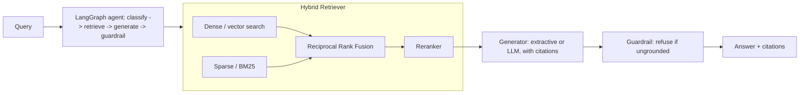

# discovery-ai

[](./.github/workflows/ci.yml)

> Reference implementation of enterprise **hybrid search + RAG + agentic orchestration**. Dense
> (vector) and sparse (BM25) retrieval fused with Reciprocal Rank Fusion, cross-encoder-style
> reranking, grounded generation with citations, a guardrail that refuses ungrounded answers, a
> LangGraph agent, and a retrieval evaluation harness (precision@k, MRR).

Part of the [Enterprise Platform Reference Architecture](../README.md). Models the enterprise search
domain as a domain-agnostic discovery capability. See
[`docs/INDUSTRY-APPLICABILITY.md`](docs/INDUSTRY-APPLICABILITY.md).

The retrieval/RAG **core is pure Python with zero third-party dependencies**, so it is fully
unit-tested and trivial to reason about. Production components (real embedding models, pgvector, a
cross-encoder, an LLM) plug in behind small interfaces without touching orchestration.

## Architecture



## Run it

### Tests + evaluation (no infra, no ML deps)
```bash
python -m venv .venv && source .venv/bin/activate
pip install pytest
pytest -q
python -m eval.evaluate     # prints precision@k and MRR
```

### API
```bash
pip install fastapi uvicorn pydantic
PYTHONPATH=src CORPUS_DIR=data/corpus uvicorn discovery.api:app --reload
# POST /search   {"query": "..."}
# POST /answer   {"query": "..."}   -> grounded answer + citations
# POST /agent    {"query": "..."}   -> agent run with node trace
```

### Docker
```bash
docker compose up --build   # app on :8000, pgvector on :5433
```

## Components
| Module | Responsibility | Swap for production |
|---|---|---|
| `embeddings.py` | Hashing embedder (default) | sentence-transformers / OpenAI / Azure OpenAI |
| `bm25.py` | BM25 Okapi lexical ranker | OpenSearch / Elasticsearch |
| `vectorstore.py` | In-memory cosine index | pgvector / Qdrant / Milvus |
| `fusion.py` | Reciprocal Rank Fusion | — |
| `rerank.py` | Lexical-overlap reranker | bge-reranker / Cohere Rerank |
| `generator.py` | Extractive generator (default) | LLMGenerator (OpenAI/Azure/Bedrock) |
| `agent.py` | SimpleAgent + LangGraph build | LangGraph runtime |

## Documentation
- [System design + SLOs + capacity](docs/SYSTEM-DESIGN.md)
- [Industry applicability](docs/INDUSTRY-APPLICABILITY.md)
- Business & governance: [BRD](docs/BRD.md) - [SOP](docs/SOP.md) - [NFR](docs/NFR.md) - [Cost savings](docs/COST-SAVINGS.md)
- ADRs: [`docs/adr/`](docs/adr/)

## Tech
Python 3.11+, FastAPI, LangGraph, pgvector (prod), pytest. Pure-Python retrieval core.
