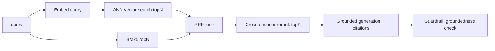

# System Design: discovery-ai

## 1. Problem
Provide low-latency, high-precision search and grounded question answering over an enterprise corpus,
with safety guarantees (no hallucinated/ungrounded answers) and measurable retrieval quality.

## 2. SLOs
| Concern | Target |
|---|---|
| Search latency | p99 < 300 ms (retrieve + rerank), excluding LLM generation |
| Answer latency | p99 < 2.5 s with LLM generation |
| Retrieval quality | MRR >= 0.8, precision@5 >= 0.7 on the labeled eval set |
| Groundedness | 100% of returned answers carry >= 1 citation or explicitly refuse |
| Availability | 99.9% |

## 3. Why hybrid retrieval
- Dense (vector) retrieval captures semantic similarity but misses exact identifiers/codes.
- Sparse (BM25) retrieval nails exact terms (claim codes, SKUs, account numbers) but misses paraphrase.
- Fusing both with RRF gets the best of each; RRF fuses on rank position so the two score scales never
  need calibration. A reranker then maximizes precision on the fused candidate set.

## 4. Capacity math
- Corpus of 10M chunks, 768-dim float32 embeddings = 10M x 768 x 4 B ~= **30 GB** of vectors.
- Fits in memory on a single large node, but for HA and growth use pgvector/Qdrant with HNSW indexes.
- HNSW query is ~O(log N); target < 20 ms for ANN search at this scale, leaving budget for rerank.
- Reranking 50 candidates with a cross-encoder is the latency-dominant step; cap candidate_k and batch.

## 5. Pipeline

## 6. Failure modes and mitigations
| Failure | Mitigation |
|---|---|
| Vector store down | Degrade to BM25-only (still returns results) |
| LLM unavailable / over budget | Fall back to extractive generator (offline, deterministic) |
| Hallucination | Guardrail requires citations; refuses ungrounded answers |
| Stale index | Incremental re-index from the lakehouse feature/document store |
| Quality regression | CI runs the eval harness; gate merges on MRR/precision thresholds |

## 7. Evaluation
`eval/evaluate.py` computes precision@k and MRR against `eval/dataset.jsonl`. This runs in CI so a
retrieval regression fails the build -- treating search quality as a tested, non-negotiable contract.
